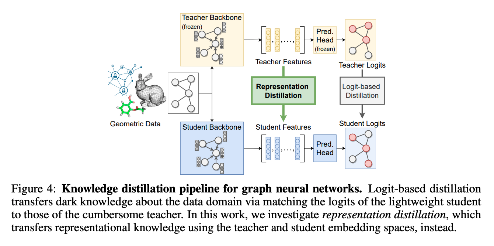
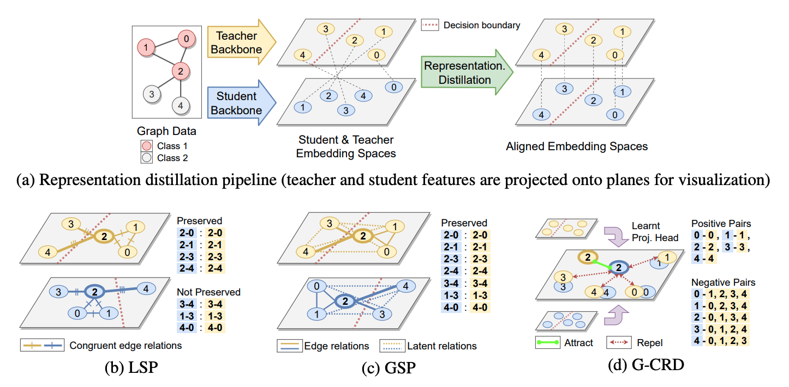

# Knowledge Distillation for Resource-efficient Graph Neural Networks

This repository provides resources on Graph Neural Network efficiency and scalability, as well as implementations of knowledge distillation techniques for developing resource-efficient GNNs.



Check out the accompanying paper ['On Representation Knowledge Distillation for Graph Neural Networks'](https://arxiv.org/abs/2111.04964), which introduces new GNN distillation techniques using contrastive learning to preserve the global topology of teacher and student embeddings.

> Chaitanya K. Joshi, Fayao Liu, Xu Xun, Jie Lin, and Chuan Sheng Foo. On Representation Knowledge Distillation for Graph Neural Networks. IEEE Transactions on Neural Networks and Learning Systems (TNNLS), *Special Issue on Deep Neural Networks for Graphs: Theory, Models, Algorithms and Applications*.
>
> [PDF](https://arxiv.org/pdf/2111.04964.pdf) | [Blog](https://www.chaitjo.com/post/efficient-gnns/)

❓New to GNN scalability: See [`awesome-efficient-gnns.md`](awesome-efficient-gnns.md) and the [accompanying blogpost](https://www.chaitjo.com/post/efficient-gnns/) for a currated overview of papers on efficient and scalable Graph Representation Learning for real-world applications.

## Distillation Techniques



We benchmark the following knowledge distillation techniques for GNNs:
- **Local Structure Preserving loss**, [Yang et al., CVPR 2020](https://arxiv.org/abs/2003.10477): preserve pairwise relationships over graph edges, but may not preserve global topology due to latent interactions. 
- **Global Structure Preserving loss**, [Joshi et al., TNNLS 2022](https://arxiv.org/abs/2111.04964): preserve all pairwise global relationships, but computationally more cumbersome.
- 🌟 **Graph Contrastive Representation Distillation**, [Joshi et al., TNNLS 2022](https://arxiv.org/abs/2111.04964): contrastive learning among positive/negative pairwise relations across the teacher and student embedding spaces.
- 🔥 Your new GNN distillation technique?

We also include baselines: **Logit-based KD**, [Hinton et al., 2015](https://arxiv.org/abs/1503.02531); and feature mimicking baselines for computer vision: **FitNet**, [Romero et al., 2014](https://arxiv.org/abs/1412.6550), **Attention Transfer**, [Zagoruyko and Komodakis, 2016](https://arxiv.org/abs/1612.03928).

## Datasets and Architectures

We conduct benchmarks on large-scale and real-world graph datasets, where the performance gap between expressive+cumbersome teacher and resource-efficient student GNNs is non-negligible:
- **Graph classification** on `MOLHIV` from Open Graph Benchmark/MoleculeNet -- GIN-E/PNA teachers, GCN/GIN students.
- **Node classification** on `ARXIV` and `MAG` from Open Graph Benchmark and Microsoft Academic Graph -- GAT/R-GCN teachers, GCN/GraphSage/SIGN students.
- **3D point cloud segmentation** on `S3DIS` -- not released publicly yet.
- **Node classification** on `PPI` -- provided to reproduce results from [Yang et al.](https://arxiv.org/abs/2003.10477)

## Installation and Usage

Our results are reported with Python 3.7, PyTorch, 1.7.1, and CUDA 11.0.
We used the following GPUs: RTX3090 for ARXIV/MAG, V100 for MOLHIV/S3DIS.

Usage instructions for each dataset are provided within the corresponding directory.

```sh
# Create new conda environment
conda create -n ogb python=3.7
conda activate ogb

# Install PyTorch (Check CUDA version!)
conda install pytorch=1.7.1 cudatoolkit=11.0 -c pytorch

# Install DGL
conda install -c dglteam dgl-cuda11.0

# Install PyG
CUDA=cu110
pip3 install torch-scatter -f https://pytorch-geometric.com/whl/torch-1.7.1+${CUDA}.html
pip3 install torch-sparse -f https://pytorch-geometric.com/whl/torch-1.7.1+${CUDA}.html
pip3 install torch-cluster -f https://pytorch-geometric.com/whl/torch-1.7.1+${CUDA}.html
pip3 install torch-spline-conv -f https://pytorch-geometric.com/whl/torch-1.7.1+${CUDA}.html
pip3 install torch-geometric

# Install other dependencies
conda install tqdm scikit-learn pandas urllib3 tensorboard
pip3 install ipdb, nvidia-ml-py3

# Install OGB
pip3 install -U ogb
```

## Citation

```
@article{joshi2022representation,
  title={On Representation Knowledge Distillation for Graph Neural Networks},
  author={Chaitanya K. Joshi and Fayao Liu and Xu Xun and Jie Lin and Chuan-Sheng Foo},
  journal={IEEE Transactions on Neural Networks and Learning Systems},
  year={2022}
}

@article{joshi2022dlforrouting,
  author = {Joshi, Chaitanya K.},
  title = {Recent Advances in Efficient and Scalable Graph Neural Networks},
  year = {2022},
  howpublished = {\url{https://www.chaitjo.com/post/efficient-gnns/}},
}
```