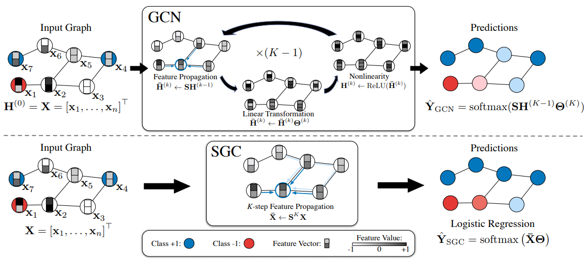
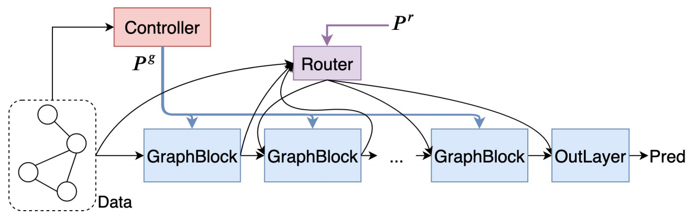
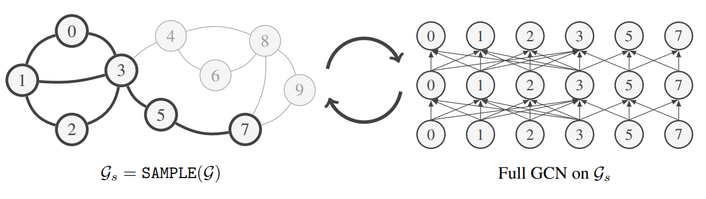
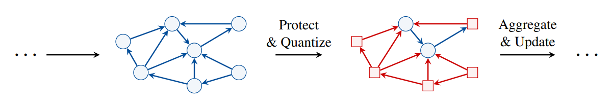
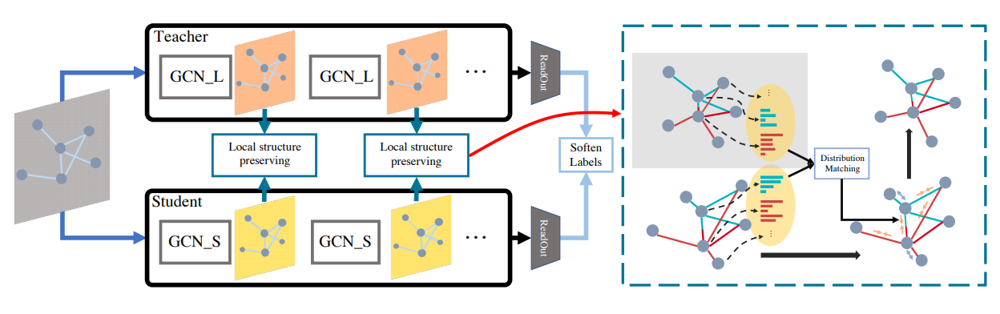
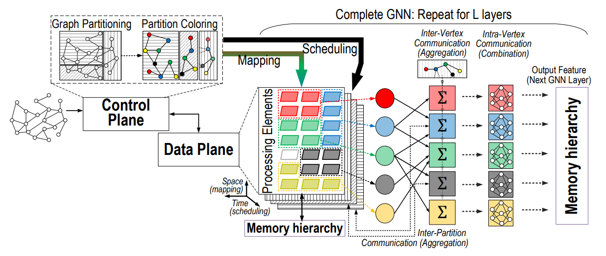
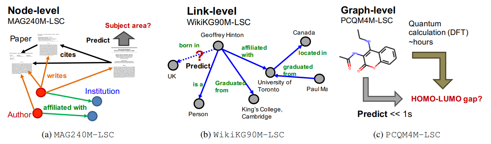
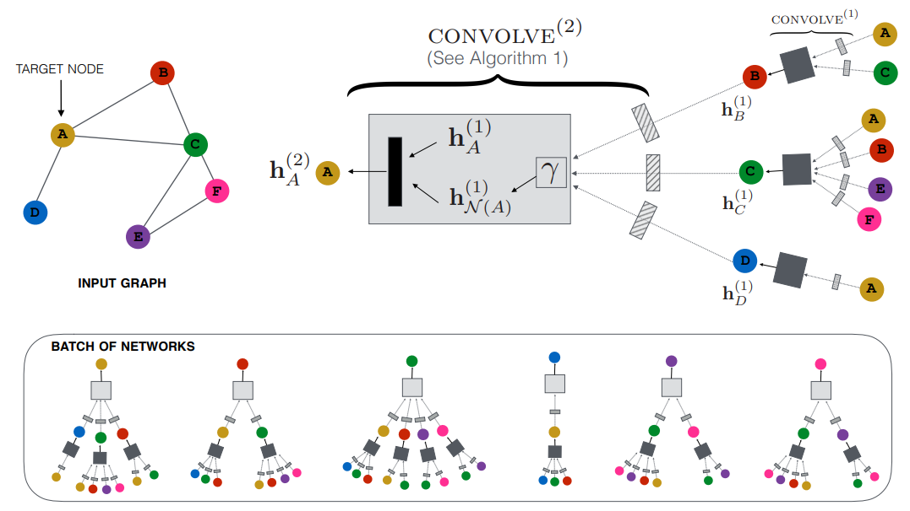

# 🚀 Awesome Efficient Graph Neural Networks

This is a curated list of must-read papers on efficient **Graph Neural Networks** and scalable **Graph Representation Learning** for real-world applications. 
Contributions for new papers and topics are welcome!

## Efficient and Scalable GNN Architectures
- [ICML 2019] [**Simplifying Graph Convolutional Networks**](https://arxiv.org/abs/1902.07153). Felix Wu, Tianyi Zhang, Amauri Holanda de Souza Jr., Christopher Fifty, Tao Yu, Kilian Q. Weinberger.
- [ICML 2020 Workshop] [**SIGN: Scalable Inception Graph Neural Networks**](https://arxiv.org/abs/2004.11198). Fabrizio Frasca, Emanuele Rossi, Davide Eynard, Ben Chamberlain, Michael Bronstein, Federico Monti.
- [ICLR 2021 Workshop] [**Adaptive Filters and Aggregator Fusion for Efficient Graph Convolutions**](https://arxiv.org/abs/2104.01481). Shyam A. Tailor, Felix L. Opolka, Pietro Liò, Nicholas D. Lane.
- [ICLR 2021] [**On Graph Neural Networks versus Graph-Augmented MLPs**](https://arxiv.org/pdf/2010.15116.pdf). Lei Chen, Zhengdao Chen, Joan Bruna.
- [ICML 2021] [**Training Graph Neural Networks with 1000 Layers**](https://arxiv.org/abs/2106.07476). Guohao Li, Matthias Müller, Bernard Ghanem, Vladlen Koltun.

    
     
    <em>Source: Simplifying Graph Convolutional Networks</em>

## Neural Architecture Search for GNNs
- [IJCAI 2020] [**GraphNAS: Graph Neural Architecture Search with Reinforcement Learning**](https://arxiv.org/abs/1904.09981). Yang Gao, Hong Yang, Peng Zhang, Chuan Zhou, Yue Hu.
- [AAAI 2021 Workshop] [**Probabilistic Dual Network Architecture Search on Graphs**](https://arxiv.org/abs/2003.09676). Yiren Zhao, Duo Wang, Xitong Gao, Robert Mullins, Pietro Lio, Mateja Jamnik.
- [IJCAI 2021] [**Automated Machine Learning on Graphs: A Survey**](https://arxiv.org/abs/2103.00742).
Ziwei Zhang, Xin Wang, Wenwu Zhu.

    
     
    <em>Source: Probabilistic Dual Network Architecture Search on Graphs</em>

## Large-scale Graphs and Sampling Techniques
- [KDD 2019] [**Cluster-GCN: An Efficient Algorithm for Training Deep and Large Graph Convolutional Networks**](https://arxiv.org/abs/1905.07953). Wei-Lin Chiang, Xuanqing Liu, Si Si, Yang Li, Samy Bengio, Cho-Jui Hsieh.
- [ICLR 2020] [**GraphSAINT: Graph Sampling Based Inductive Learning Method**](https://arxiv.org/abs/1907.04931). Hanqing Zeng, Hongkuan Zhou, Ajitesh Srivastava, Rajgopal Kannan, Viktor Prasanna.
- [CVPR 2020] [**L2-GCN: Layer-Wise and Learned Efficient Training of Graph Convolutional Networks**](https://openaccess.thecvf.com/content_CVPR_2020/html/You_L2-GCN_Layer-Wise_and_Learned_Efficient_Training_of_Graph_Convolutional_Networks_CVPR_2020_paper.html). Yuning You, Tianlong Chen, Zhangyang Wang, Yang Shen.
- [KDD 2020] [**Scaling Graph Neural Networks with Approximate PageRank**](https://arxiv.org/abs/2007.01570). Aleksandar Bojchevski, Johannes Klicpera, Bryan Perozzi, Amol Kapoor, Martin Blais, Benedek Rózemberczki, Michal Lukasik, Stephan Günnemann.
- [ICML 2021] [**GNNAutoScale: Scalable and Expressive Graph Neural Networks via Historical Embeddings**](https://arxiv.org/abs/2106.05609). Matthias Fey, Jan E. Lenssen, Frank Weichert, Jure Leskovec.
- [ICLR 2021] [**Graph Traversal with Tensor Functionals: A Meta-Algorithm for Scalable Learning**](https://arxiv.org/abs/2102.04350). Elan Markowitz, Keshav Balasubramanian, Mehrnoosh Mirtaheri, Sami Abu-El-Haija, Bryan Perozzi, Greg Ver Steeg, Aram Galstyan.

    
     
    <em>Source: GraphSAINT: Graph Sampling Based Inductive Learning Method</em>

## Low Precision and Quantized GNNs
- [EuroMLSys 2021] [**Learned Low Precision Graph Neural Networks**](https://arxiv.org/abs/2009.09232). Yiren Zhao, Duo Wang, Daniel Bates, Robert Mullins, Mateja Jamnik, Pietro Lio.
- [ICLR 2021] [**Degree-Quant: Quantization-Aware Training for Graph Neural Networks**](https://arxiv.org/abs/2008.05000). Shyam A. Tailor, Javier Fernandez-Marques, Nicholas D. Lane.
- [CVPR 2021] [**Binary Graph Neural Networks**](https://arxiv.org/abs/2012.15823). Mehdi Bahri, Gaétan Bahl, Stefanos Zafeiriou.

    
     
    <em>Source: Degree-Quant: Quantization-Aware Training for Graph Neural Networks</em>

## Knowledge Distillation for GNNs
- [CVPR 2020] [**Distilling Knowledge from Graph Convolutional Networks**](https://arxiv.org/abs/2003.10477). Yiding Yang, Jiayan Qiu, Mingli Song, Dacheng Tao, Xinchao Wang.
- [WWW 2021] [**Extract the Knowledge of Graph Neural Networks and Go Beyond it: An Effective Knowledge Distillation Framework**](https://arxiv.org/abs/2103.02885). Cheng Yang, Jiawei Liu, Chuan Shi.
- [IJCAI 2021] [**On Self-Distilling Graph Neural Network**](https://www.ijcai.org/proceedings/2021/314). Yuzhao Chen, Yatao Bian, Xi Xiao, Yu Rong, Tingyang Xu, Junzhou Huang.
- [IJCAI 2021] [**Graph-Free Knowledge Distillation for Graph Neural Networks**](https://arxiv.org/abs/2105.07519). Xiang Deng, Zhongfei Zhang.

    
     
    <em>Source: Distilling Knowledge from Graph Convolutional Networks</em>

## Hardware Acceleration of GNNs
- [IPDPS 2019] [**Accurate, Efficient and Scalable Graph Embedding**](https://arxiv.org/abs/1810.11899). Hanqing Zeng, Hongkuan Zhou, Ajitesh Srivastava, Rajgopal Kannan, Viktor Prasanna.
- [IEEE TC 2020] [**EnGN: A High-Throughput and Energy-Efficient Accelerator for Large Graph Neural Networks**](https://arxiv.org/abs/1909.00155). Shengwen Liang, Ying Wang, Cheng Liu, Lei He, Huawei Li, Xiaowei Li.
- [FPGA 2020] [**GraphACT: Accelerating GCN Training on CPU-FPGA Heterogeneous Platforms**](https://arxiv.org/abs/2001.02498). Hanqing Zeng, Viktor Prasanna.
- [IEEE CAD 2021] [**Rubik: A Hierarchical Architecture for Efficient Graph Learning**](https://arxiv.org/abs/2009.12495). Xiaobing Chen, Yuke Wang, Xinfeng Xie, Xing Hu, Abanti Basak, Ling Liang, Mingyu Yan, Lei Deng, Yufei Ding, Zidong Du, Yunji Chen, Yuan Xie.
- [ACM Computing 2021] [**Computing Graph Neural Networks: A Survey from Algorithms to Accelerators**](https://arxiv.org/abs/2010.00130). Sergi Abadal, Akshay Jain, Robert Guirado, Jorge López-Alonso, Eduard Alarcón.

    
     
    <em>Source: Computing Graph Neural Networks: A Survey from Algorithms to Accelerators</em>

## Code Frameworks, Libraries, and Datasets

- [PyG] [**PyTorch Geometric**](https://www.pyg.org/).
- [DGL] [**Deep Graph Library**](https://www.dgl.ai/).
- [NeurIPS 2020] [**Open Graph Benchmark: Datasets for Machine Learning on Graphs**](https://arxiv.org/abs/2005.00687). Weihua Hu, Matthias Fey, Marinka Zitnik, Yuxiao Dong, Hongyu Ren, Bowen Liu, Michele Catasta, Jure Leskovec.
- [KDD Cup 2021] [**OGB-LSC: A Large-Scale Challenge for Machine Learning on Graphs**](https://ogb.stanford.edu/kddcup2021/) Weihua Hu, Matthias Fey, Hongyu Ren, Maho Nakata, Yuxiao Dong, Jure Leskovec.
- [CIKM 2021] [**PyTorch Geometric Temporal: Spatiotemporal Signal Processing with Neural Machine Learning Models**](https://arxiv.org/abs/2104.07788). Benedek Rozemberczki, Paul Scherer, Yixuan He, George Panagopoulos, Alexander Riedel, Maria Astefanoaei, Oliver Kiss, Ferenc Beres, Guzmán López, Nicolas Collignon, Rik Sarkar.

    
     
    <em>Source: OGB-LSC: A Large-Scale Challenge for Machine Learning on Graphs</em>

## Industrial Applications and Systems
- [KDD 2018] [**Graph Convolutional Neural Networks for Web-Scale Recommender Systems**](https://arxiv.org/abs/1806.01973). Rex Ying, Ruining He, Kaifeng Chen, Pong Eksombatchai, William L. Hamilton, Jure Leskovec.
- [VLDB 2019] [**AliGraph: A Comprehensive Graph Neural Network Platform**](https://arxiv.org/abs/1902.08730). Rong Zhu, Kun Zhao, Hongxia Yang, Wei Lin, Chang Zhou, Baole Ai, Yong Li, Jingren Zhou.
- [KDD 2020] [**PinnerSage: Multi-Modal User Embedding Framework for Recommendations at Pinterest**](https://arxiv.org/abs/2007.03634) Aditya Pal, Chantat Eksombatchai, Yitong Zhou, Bo Zhao, Charles Rosenberg, Jure Leskovec.
- [CIKM 2020] [**P-Companion: A Principled Framework for Diversified Complementary Product Recommendation**](https://dl.acm.org/doi/10.1145/3340531.3412732) Junheng Hao, Tong Zhao, Jin Li, Xin Luna Dong, Christos Faloutsos, Yizhou Sun, and Wei Wang.
- [CIKM 2021] [**ETA Prediction with Graph Neural Networks in Google Maps**](https://arxiv.org/abs/2108.11482). Austin Derrow-Pinion, Jennifer She, David Wong, Oliver Lange, Todd Hester, Luis Perez, Marc Nunkesser, Seongjae Lee, Xueying Guo, Brett Wiltshire, Peter W. Battaglia, Vishal Gupta, Ang Li, Zhongwen Xu, Alvaro Sanchez-Gonzalez, Yujia Li, Petar Veličković.

    
     
    <em>Source: Graph Convolutional Neural Networks for Web-Scale Recommender Systems</em>

