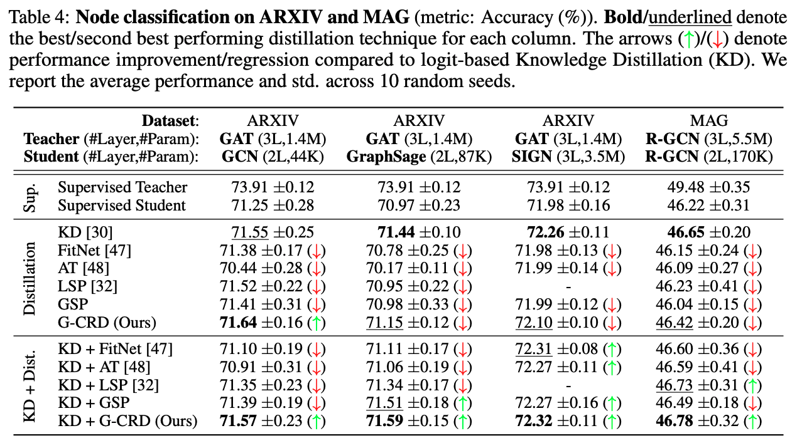

# Knowledge Distillation for GNNs (ARXIV with PyG)

**Dataset**: ARXIV

**Library**: PyG

This repository contains code to benchmark knowledge distillation for GNNs on the ARXIV dataset, developed in the PyG framework.
The main purpose of the PyG codebase is to:
- Train student models GCN and GraphSage on the ARXIV dataset with/without knowledge distillation.

Note that the teacher GNNs are trained on ARXIV via the DGL implementation in `arxiv_dgl`.
To train students via PyG, you first need to train and dump teacher models via DGL (the PyG implementation for teachers gave OOM errors).



## Directory Structure

```
.
├── dataset                     # automatically created by OGB data downloaders
├── logs                        # logging directory for student models
|
├── scripts                     # scripts to conduct full experiments and reproduce results
│   ├── run_gcn.sh              # script to benchmark all KD losses for GCN
│   ├── run_kd_and_aux.sh       # script to benchmark all KD+Auxiliary losses
│   └── run_sage.sh             # script to benchmark all KD losses for GraphSage
|
├── README.md
|
├── correlation.py              # script used to compute structural correlation among teacher-student embedding spaces (CKA and Mantel Tests)
├── criterion.py                # KD loss functions
├── gnn_kd_and_aux.py           # train student GNNs via KD+Auxiliary loss training
├── gnn.py                      # train student GNNs via Auxiliary representation distillation loss
├── logger.py                   # logging utilities
├── submit.py                   # read log directory to aggregate results
└── test.py                     # test model checkpoint and timing
```

## Example Usage

For full usage, each file has accompanying flags and documentation.
Also see the `scripts` folder for reproducing results.
