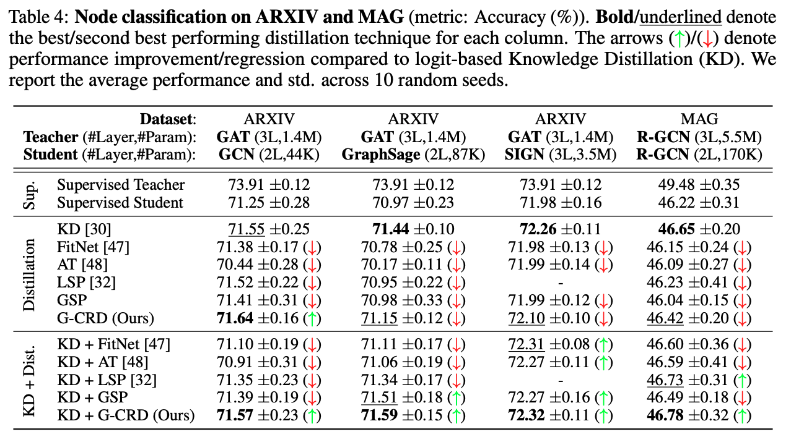

# Knowledge Distillation for GNNs (MAG with PyG)

**Dataset**: MAG

**Library**: PyG

This repository contains code to benchmark knowledge distillation for GNNs on the MAG dataset, developed in the PyG framework.
The main purpose of the codebase is to:
- Train teacher R-GCN models on MAG dataset via supervised learning and export the checkpoints
- Train student R-GCN models with/without knowledge distillation.



## Directory Structure

```
.
├── dataset                     # automatically created by OGB data downloaders
|
├── scripts                     # scripts to conduct full experiments and reproduce results
│   ├── run_kd_and_aux.sh       # script to benchmark all KD+Auxiliary losses
│   ├── run.sh                  # script to benchmark all KD losses
│   └── teacher.sh              # script to train and save teacher checkpoints
|
├── README.md
|
├── criterion.py                # KD loss functions
├── gnn_kd_and_aux.py           # train student GNNs via KD+Auxiliary loss training
├── gnn.py                      # train student GNNs via Auxiliary representation distillation loss
├── logger.py                   # logging utilities
├── submit.py                   # read log directory to aggregate results
└── test.py                     # test model checkpoint and timing
```

## Example Usage

For full usage, each file has accompanying flags and documentation.
Also see the `scripts` folder for reproducing results.
