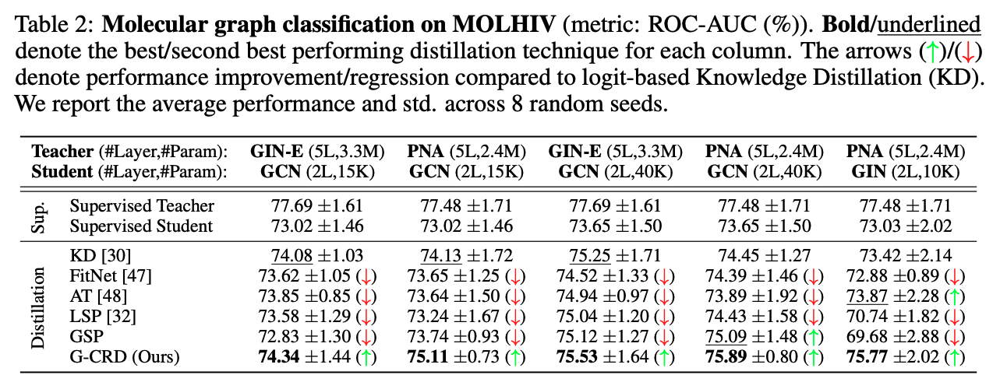

# Knowledge Distillation for GNNs (Graph classification on OGBG-MOL* datasets)

**Dataset**: MOLHIV (and other OGBG-MOL* datasets)

**Library**: PyG

This folder contains code to benchmark knowledge distillation for GNNs on various molecular graph classification datasets from OGBG-MOL*, experiments were predominantly done on MOLHIV.

Under preparation.

