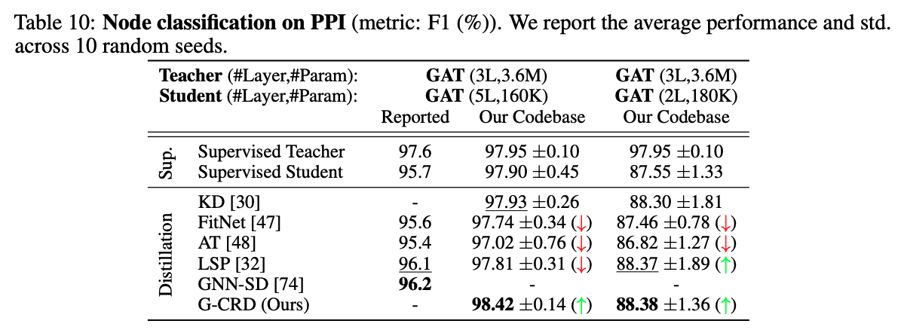

# Knowledge Distillation for GNNs (PPI with PyG)

**Dataset**: PPI

**Library**: PyG

This repository contains code to benchmark knowledge distillation for GNNs on the PPI dataset, developed in the PyG framework.
The main purpose of the codebase is to:
- Train teacher GAT models on PPI dataset via supervised learning and export the checkpoints
- Train student GAT models with/without knowledge distillation.



## Directory Structure

```
.
├── checkpoints
├── logs
├── data                    # automatically created by OGB data downloaders
|
├── scripts                 # scripts to conduct full experiments and reproduce results
│   ├── baselines.sh        # script to train student models without KD
│   ├── run.sh              # script to benchmark all KD losses
│   └── train_teacher.sh    # script to train and save teacher checkpoints
|
├── README.md
|
├── criterion.py            # KD loss functions
├── gnn.py                  # train student GNNs via auxiliary representation distillation loss
├── train_teacher.py        # train teacher GNNs and export checkpoints
├── logger.py               # logging utilities
└── submit.py               # read log directory to aggregate results
```

## Example Usage

For full usage, each file has accompanying flags and documentation.
Also see the `scripts` folder for reproducing results.
